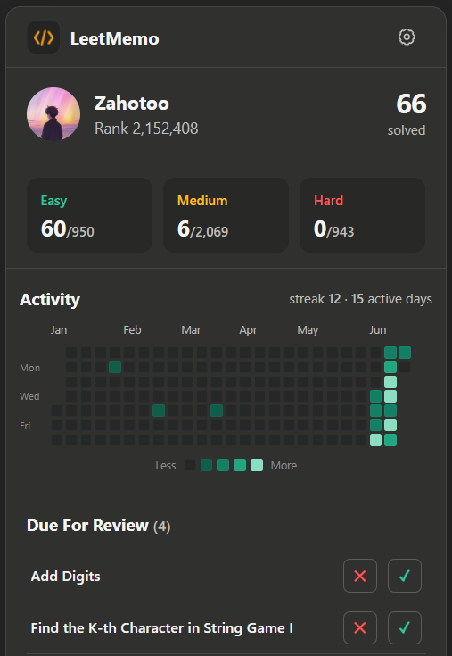
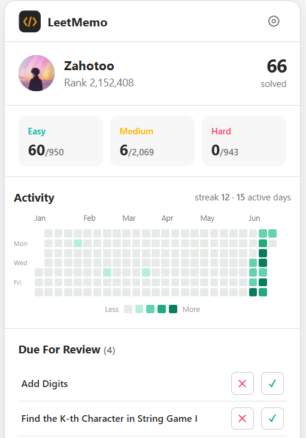

# LeetMemo

A Chrome extension that helps you actually remember LeetCode solutions, using problem notes and spaced repetition.

## Overview

Solving a problem once doesn't mean you'll remember it on interview day. LeetMemo pulls in your recent LeetCode submissions, lets you save notes on each one, and schedules them for review at increasing intervals — so the solutions stick.

## Features

- **Profile dashboard** — your ranking, solved counts, and a submission activity heatmap for the year
- **Recent submissions** — your five most recent accepted problems
- **Problem notes** — save notes (approach, complexity, edge cases) per problem
- **Spaced-repetition reviews** — solved problems are queued and resurface at growing intervals
- **Pass / Fail** — mark each review; passing pushes it further out, failing resets it to tomorrow
- **Due-count badge** — the toolbar icon shows how many reviews are due, updated in the background even when the popup is closed
- **Quick links** — open any profile or problem directly on LeetCode
- **Light / dark mode** — everything stored locally, no account needed

## How it works

```
[Extension popup]  →  [LeetCode GraphQL API]  →  [chrome.storage.local]
```

1. You enter your username; the popup fetches your profile and recent submissions from LeetCode's public GraphQL API.
2. Each accepted problem is added to a review queue, stored locally in `chrome.storage.local`.
3. When a problem is due, it appears under **Due For Review**. You re-solve it and mark Pass or Fail.

New problems are first scheduled for the next day. Each time you pass, the next review moves further out:

```
1 → 3 → 7 → 14 → 30 → 60 → 120 days
```

A failed review resets the problem back to a one-day interval.

A background service worker re-checks the queue (on startup and once an hour) and keeps the toolbar icon badge showing how many reviews are due — so you get a nudge without opening the popup.

## Tech stack

- Chrome Extension Manifest V3
- Vanilla HTML / CSS / JavaScript (ES modules)
- LeetCode public GraphQL API
- `chrome.storage.local` for notes, preferences, and review progress
- Background service worker + `chrome.alarms` for the due-count badge

## Installation

1. Clone the repo:
   ```
   git clone https://github.com/Thehan05/LeetMemo.git
   ```
2. Open Chrome and go to `chrome://extensions`.
3. Enable **Developer mode** (top right).
4. Click **Load unpacked** and select the `LeetMemo` folder.
5. Click the LeetMemo icon in your toolbar, enter your LeetCode username, and hit **Load**.

## Usage

**Load your profile** — Open LeetMemo, enter your LeetCode username, and hit **Load**. Your stats, activity, reviews, and recent submissions appear. The username is remembered for next time.

**Save notes** — Pick a problem under **Recent Submissions**, write your notes, and select **Save note**. Good notes cover the approach/pattern, time and space complexity, edge cases, and mistakes from your first attempt.

**Complete a review** — Open a problem under **Due For Review**, re-solve it or explain it from memory, then mark it **Pass** or **Fail**. Passing increases the interval; failing schedules it again for the next day.

## Project structure

```
LeetMemo/
├── css/                  # Popup layout and component styles
├── icons/                # Chrome extension icons
├── js/
│   ├── api/              # LeetCode GraphQL requests
│   ├── features/         # Profile, heatmap, notes, reviews, theme
│   ├── services/         # Storage and review scheduling
│   ├── utils/            # Shared formatting helpers
│   ├── background.js     # Service worker: badge count + hourly review check
│   └── popup.js          # Extension entry point
├── manifest.json         # Chrome extension config
├── popup.html            # Popup UI
└── README.md
```

## Screenshots

<p align="center">
  
  
</p>
